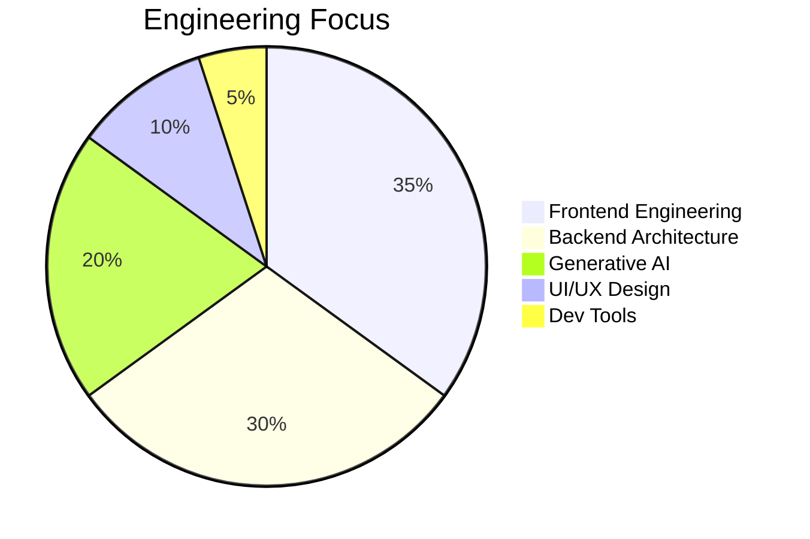

# 🧠⚡ RAHUL UPADHYAY — SOFTWARE ENGINEER

  

  <b>MERN Stack • Generative AI • UI/UX Engineering</b> 
  Turning ideas into production-grade systems

  
  
  

---

## 🚀 ABOUT ME (WHAT RECRUITERS CARE ABOUT)

I am a **product-minded Software Engineer** who builds **scalable, secure, and AI-powered web applications**.

I don’t just write code —
I **design systems**, **optimize performance**, and **ship production-ready products**.

**Core philosophy**

* Clean architecture over hacks
* UI/UX is part of engineering
* AI is a feature, not a gimmick
* Code should scale with the business

---

## 🧰 TECH STACK (PRODUCTION-READY)

### Frontend

* React, Next.js
* JavaScript (ES6+)
* Tailwind CSS

### Backend

* Node.js, Express
* REST APIs
* JWT Authentication, RBAC

### Database

* MongoDB

### Generative AI

* OpenAI APIs
* Prompt Engineering
* AI workflow integration

### Design

* Figma
* Design Systems
* Accessibility-first UI

---

## 🧠 ENGINEERING SKILL MAP

---

## 📊 PROOF OF CONSISTENCY (STABLE WIDGETS ONLY)

  
  

> These widgets are **actively maintained** and GitHub-safe.

---

## 🏆 FLAGSHIP PROJECTS (HIRING MAGNET)

### 🤖 AI SaaS Platform

* OpenAI-powered automation
* Secure backend architecture
* Role-based dashboards
* Scalable API design

### 🌐 MERN Web Platform

* Authentication & authorization
* Optimized frontend rendering
* Clean, modular backend

### 🎨 UI/UX Design System

* Figma → React workflow
* Reusable atomic components
* Accessibility-first design

---

## 📄 AUTO-RESUME DOWNLOAD (CRITICAL)

📥 **One-click resume download (PDF)**
➡️
👉 **[Download Resume](https://github.com/Git-WarLord/raw/main/Rahul_Upadhyay_Resume.pdf)**

> 📌 Upload your PDF resume to the root of this repo
> GitHub serves it instantly (no third-party service needed)

---

## 🤝 CONNECT WITH ME

  
  
  

---

<h2 align="center">💎 TOP 0.01% ENGINEER MINDSET 💎</h2>
<h4 align="center">Build • Ship • Scale • Repeat</h4>

  

