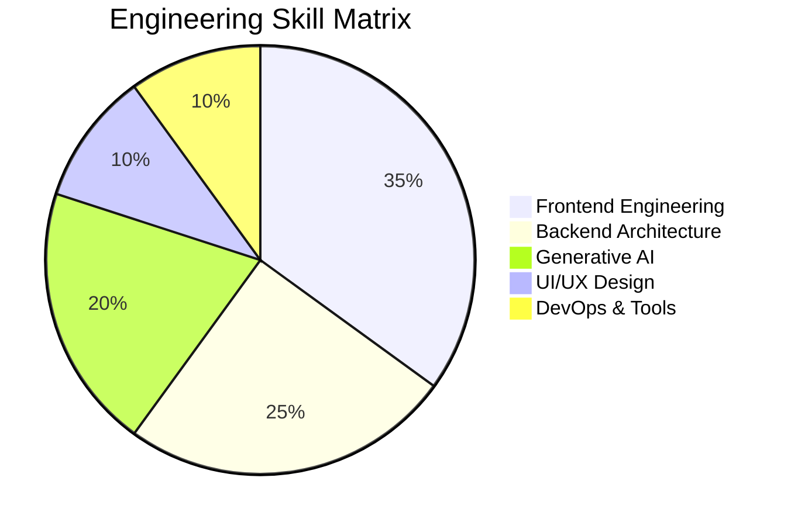

<!-- ===================== UNSTOPPABLE GITHUB PROFILE ===================== -->

<p align="center">
  
</p>

<p align="center">
  
</p>

<p align="center">
  <a href="mailto:rahulmohanupadhyay"></a>
  <a href="https://github.com/Git-WarLord"></a>
  <a href="https://www.linkedin.com/in/rahulmohanupadhyay/"></a>
  <!--  -->
</p>

---

## 🧠 Developer Manifesto

```ts
class RahulUpadhyay {
  role = "Software Developer";
  stack = ["MERN", "Gen AI", "UI/UX"];
  focus = "Scalable, secure, production-grade systems";
  philosophy = "Ship fast. Refactor smart. Scale confidently.";
  superPower = "I combine AI + Engineering + Design";
}
```

* 🚀 Product-focused engineer (not just feature builder)
* 🤖 Building **AI-first applications**
* 🎨 UI/UX driven development using **Figma → Code**
* ⚡ Performance, DX & clean architecture obsessed

---

## 🛠️ Technology Stack (Battle-Tested)


## 🌐 Socials:
[](https://instagram.com/rahul_upadhyay25) [](https://linkedin.com/in/rahulmohanupadhyay) [](mailto:rahulmohanupadhyay@gmail.com) 

# 💻 Tech Stack:
                           


### ⚛️ Frontend


### ⚙️ Backend


### 🗄️ Database


### 🤖 Gen AI


### 🎨 UI/UX


---

## 📊 Proof of Consistency

<p align="center">
  <!-- Contribution streak / graph -->
  
</p>

<p align="center">
  
</p>

---

## 🧩 Skill Intelligence Map



---

## 🚀 Flagship Projects (Recruiter Gold)

### 🤖 AI SaaS Platform

* OpenAI-powered workflows
* Role-based dashboards
* Secure API architecture

### 🌐 Enterprise MERN App

* JWT + RBAC authentication
* Scalable REST APIs
* Performance-optimized frontend

### 🎨 UI/UX Design System

* Figma → React pipeline
* Atomic design principles
* Accessibility-first approach

---

## 🏆 Engineering Highlights

* ⚡ Clean architecture & folder structuring
* 🔐 Security best practices
* 📈 Optimized rendering & state management
* 🧠 Advanced prompt engineering
* 🎯 Pixel-perfect UI execution

---

## 🐍 Contribution Snake (Auto Updated)

<p align="center">
  
</p>

---


## 🤝 Connect & Collaborate

<p align="center">
  <a href="mailto:rahulmohanupadhyay"></a>
  <a href="https://github.com/Git-WarLord"></a>
  <a href="https://www.linkedin.com/in/rahulmohanupadhyay/"></a>
  <!--  -->
</p>

---

<h2 align="center">💎 UNSTOPPABLE DEVELOPER MODE ACTIVATED 💎</h2>
<h4 align="center">Code • Design • AI • Scale</h4>

<p align="center">
  
</p>


