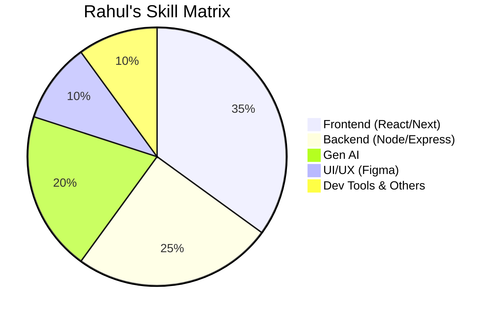

<!-- ===================== HERO SECTION ===================== -->

<h1 align="center">⚡ Rahul Upadhyay ⚡</h1>
<h3 align="center">🚀 Software Developer | MERN Stack | Gen AI | UI/UX Designer</h3>

<p align="center">
  
</p>

<p align="center">
  <a href="https://github.com/Git-WarLord"></a>
  
  
</p>

---

## 🧠 About Me

```js
const rahul = {
  role: "Software Developer",
  stack: ["MERN", "Gen AI", "UI/UX"],
  passions: ["AI Products", "Clean Architecture", "Creative UI"],
  mindset: "Build. Scale. Innovate.",
  funFact: "I turn ideas into production-ready products 🚀"
};
```

* 🔥 Strong focus on **real-world, scalable applications**
* 🤖 Building **AI-powered web experiences**
* 🎨 Designing intuitive interfaces using **Figma**
* 💡 Obsessed with performance, UX & clean code

---

## 🛠️ Tech Arsenal

### ⚛️ Frontend


### ⚙️ Backend


### 🗄️ Database


### 🤖 Gen AI


### 🎨 UI/UX


---

## 📊 GitHub Performance

<p align="center">
  
  
</p>

<p align="center">
  
</p>

---

## 🥧 Skill Distribution



---

## 🚀 Flagship Projects (Showcase)

### 🤖 AI-Powered SaaS Platform

* Gen AI integrations (OpenAI)
* Smart automation & insights
* Modern dashboard UI

### 🌐 Full-Stack MERN Application

* JWT Authentication
* Role-based access
* Analytics dashboard

### 🎨 Design System (Figma)

* Component-based UI
* Responsive-first approach
* Developer-friendly handoff

---

## 🧩 Developer Highlights

* ⚡ Production-ready architecture
* 🔐 Secure authentication patterns
* 📈 Performance-optimized React apps
* 🧠 AI prompt engineering
* 🎯 Pixel-perfect UI execution

---

## 🐍 Contribution Snake

<p align="center">
  
</p>

---

## 🤝 Connect With Me

<p align="center">
  <a href="mailto:rahulmohanupadhyay"></a>
  <a href="https://github.com/Git-WarLord"></a>
</p>

---

<h3 align="center">💎 Top 1% Mindset — Code. Create. Dominate. 💎</h3>

⭐ *Star my repositories if you like what I build!*
